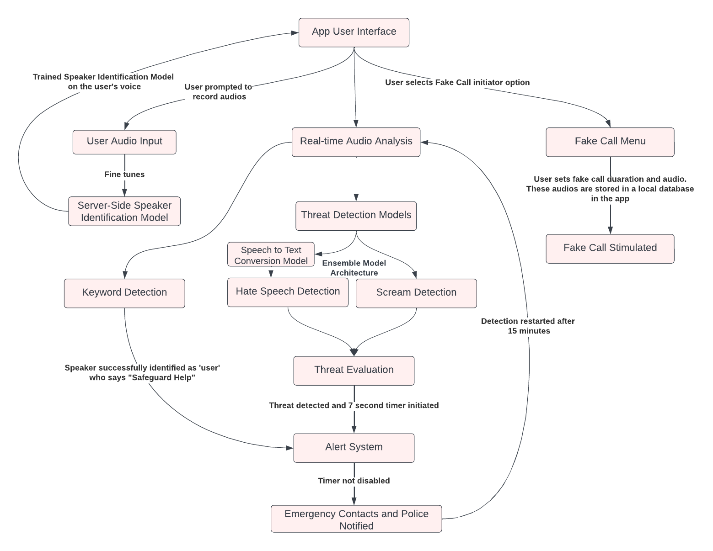

# SafeGuardHER Software Architecture

We plan to build the SafeGuardHER mobile application using the **MVC (Model-View-Controller)** architecture style. This approach provides a clear separation of concerns, enabling better scalability and maintainability.

## Architecture Diagram

Below is the architecture diagram for SafeGuardHER:

> We recommend building architecture diagrams using [Draw.io](https://app.diagrams.net/). It also has a desktop application for offline use.

You can also document your architecture using [C4Model](https://c4model.com/). We recommend C1 (System Context) and C2 (Container) diagrams to visualize the architecture at different levels of detail.

> The C4 model is a graphical notation technique for modeling the architecture of software systems. It breaks down a system into containers and components, leveraging existing modeling techniques like UML or ERD for detailed decomposition of architectural building blocks.

## Technologies

The list of technologies we use to build the SafeGuardHER application is as follows:

| Technology          | Purpose                                  | Version |
| -------------------|------------------------------------------|---------|
| Java               | Backend Programming Language              | 11.0.9  |
| Kotlin             | Android Programming Language              | Latest  |
| Android Studio     | Android Development Environment           | Latest  |
| Firebase         | Database                                   | 13.1    |
| Spring Boot        | Backend Framework                          | 2.4.1   |
| Kotlin    | Frontend Framework for Mobile Development | Latest  |
| Firebase           | Authentication and Realtime Database       | Latest  |
| Docker             | Containerization                            | Latest  |

## Non-functional Requirements

Here are the non-functional requirements for the SafeGuardHER project:

| Quality Attribute | Description                                                        | Target                                                             |
|------------------|--------------------------------------------------------------------|--------------------------------------------------------------------|
| Performance      | Response time for critical transactions                             | 2 seconds                                                          |
| Availability     | System uptime                                                       | 99.9%                                                               |
| Throughput       | Number of requests/transactions per second at peak time             | 1000 RPS                                                            |
| Auditability     | The application's ability to record user interactions and events   | Log file with timestamped records                                    |
| Reliability      | Mean time to recovery from a failure                                | Recovery within 5 minutes                                            |
| Usability        | Usability across various platforms and devices                      | Browser compatibility (Chrome, Firefox, Safari, Edge)   [Screen size] - Adaptive for mobile devices |

Ensure all developers and stakeholders are familiar with these architecture choices, technologies, and non-functional requirements to maintain a consistent understanding of the project's structure and goals.
